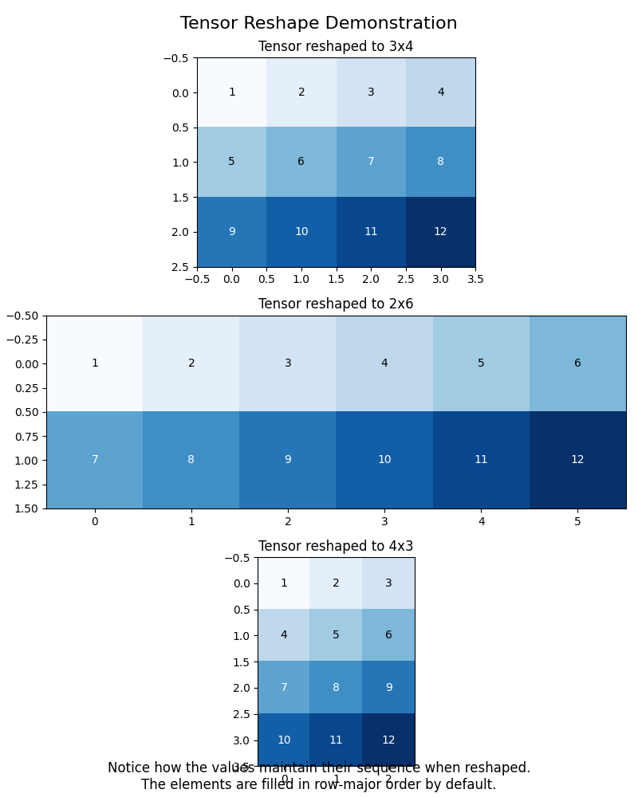

# Tensor Reshape Example

## What This Code Does

This simple example shows how to change the shape of a tensor (a multi-dimensional array of numbers). It takes a sequence of numbers from 1 to 12 and rearranges them into different grid patterns:
- A 3×4 grid (3 rows, 4 columns)
- A 2×6 grid (2 rows, 6 columns)
- A 4×3 grid (4 rows, 3 columns)



The code creates colorful visualizations that help you see how the numbers get rearranged in each pattern.

## Why Tetra Makes Sense

Tetra makes running this code on powerful GPUs super easy:

1. **No Special Hardware Needed**: You don't need an expensive computer with a GPU. Tetra sends your code to run on remote GPUs in the cloud.

2. **Simple to Use**: Just add the `@remote` decorator to your function, and Tetra handles all the complicated stuff like:
   - Sending your code to the remote GPU
   - Setting up the right environment with all needed packages
   - Running your function on the GPU
   - Sending the results back to you

3. **Works Like Local Code**: You write your code as if it's running on your own computer. Tetra makes the remote execution feel seamless.

4. **Perfect for AI and Data Science**: Operations like tensor reshaping are common in AI and can be much faster on GPUs, especially with larger datasets.

## How to Run This Example

1. Make sure you have your RunPod API key:
   ```
   export RUNPOD_API_KEY=your_api_key_here
   ```

2. Run the example:
   ```
   PYTHONPATH=/Users/rachfop/marut/tetra python examples/simple_tensor_reshape.py
   ```

3. Check out the generated visualization in `tensor_reshape_demo.png`

This example is a simple demonstration, but the same approach works for much more complex AI tasks that would be slow or impossible on a regular computer.
